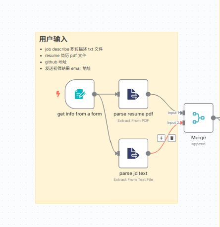
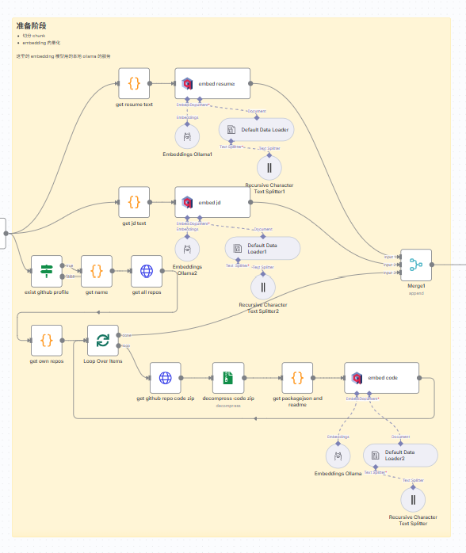
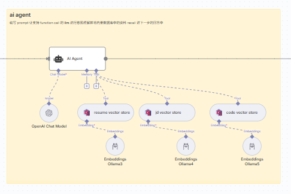
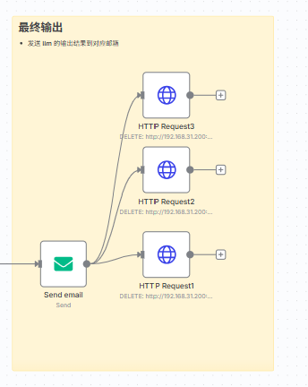
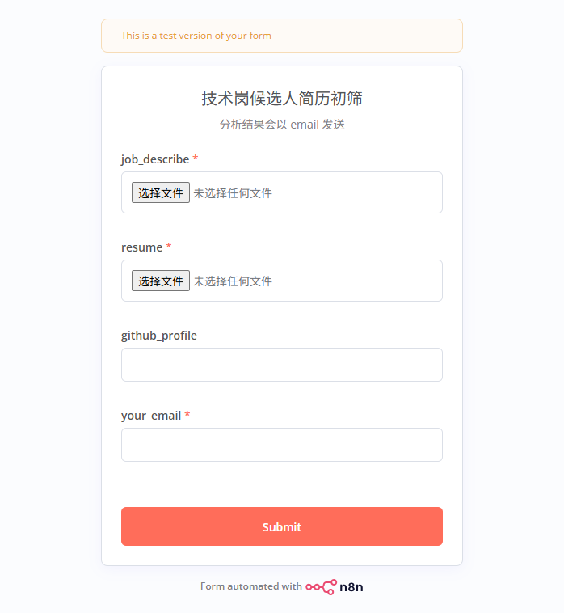
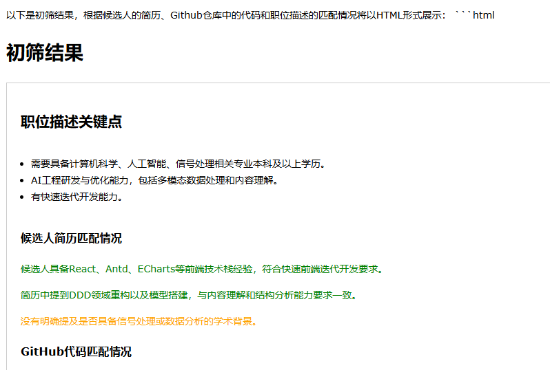

# 技术岗位候选人初筛 agent

## 背景

在进行技术岗位初筛的时候，大部分公司经常面临的问题是：技术岗位的要求 HR 并不能完全理解，在进行简历初筛的时候往往只能通过关键字。

- 从简历上看匹配上很多关键字，但在技术团队来看这个候选人在技术深度上并不过关
- 或在简历上看没匹配很多关键字，但在技术团队来看这个候选人是个技术大牛

我认为一个合格的技术简历初筛，可以从两个角度出发

- 理解技术岗位描述和简历后，看这两者是否匹配
- 理解技术人员的 github repos，看是否和岗位描述匹配

## 大概思路

1. 将岗位描述（jd）上传，将岗位描述切块后做向量化，存入向量数据库；
2. 将候选人简历（resume）上传，将简历切块后做向量化，存入向量数据库；
3. 读取候选人的 github profile，读取候选人所有自己的 repos，将 repo 下载，将其中关键的文件内容切块后做向量化，存入向量数据库；
4. 用支持调用 function call 的 llm 模型，写入合适的 prompt，将向量数据库的内容 recall 并给出最终结果。

## 具体实现

### 1 用户输入

### 2 数据准备阶段

### 3 ai agent

### 4 最终输出

## 截图

### 用户输入

### 结果邮件

## 哪里可以做的更好

- [ ] 切分 chunk 时更加合理，embedding 用更合理的模型提升表现
- [ ] agent 的 prompt 还不够完善，可以使用一些提示词工程去完善
- [ ] recall 时可以再加一个模型去 rerank 结果
